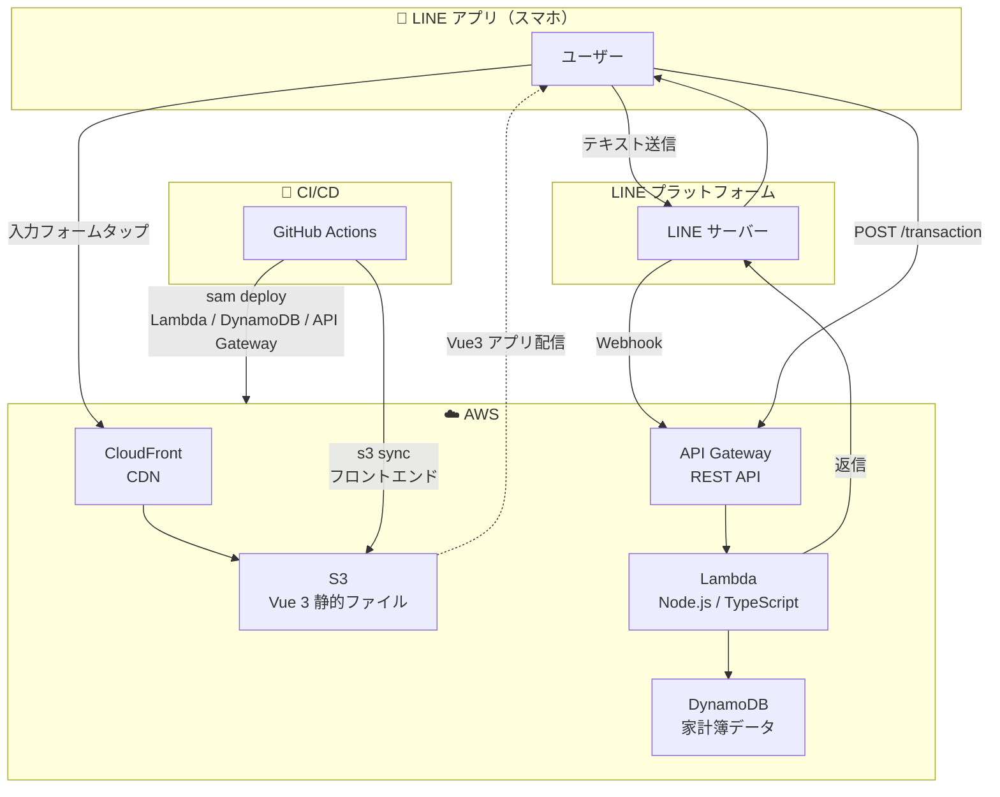
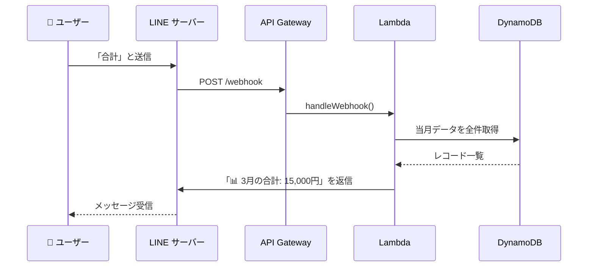
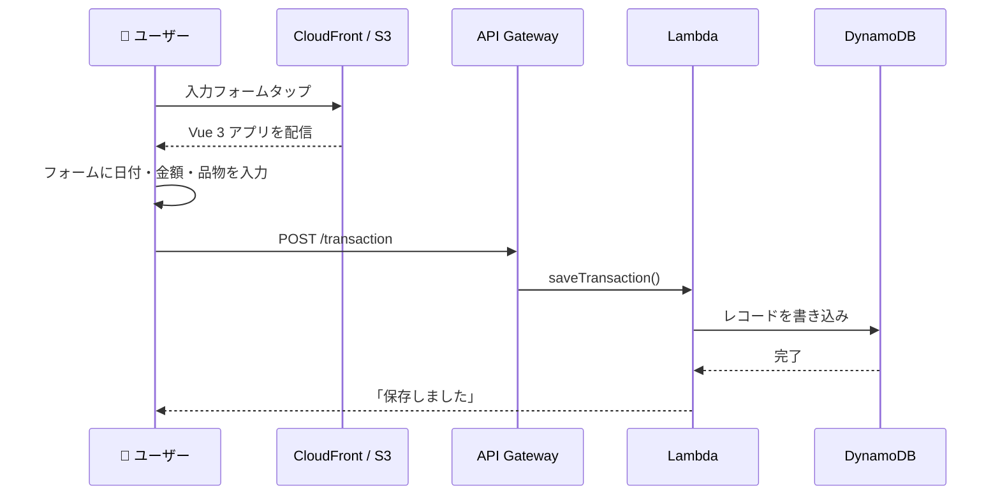

# 【記事⑧】AWS × LINE 家計簿ボット — プログラム構成とアーキテクチャ解説

> **この記事の位置づけ**: 記事①〜⑦で動くものを作った後、「なぜこのフォルダ構成にしたのか」「どこに何を書くべきか」をまとめる解説記事。コードを読み返すときや機能追加するときの地図として使う。

---

## システム構成図

> 以下の図は GitHub 上でレンダリングされる（Mermaid 記法）。VS Code では [Markdown Preview Mermaid Support](https://marketplace.visualstudio.com/items?itemName=bierner.markdown-mermaid) 拡張で確認できる。

### 全体構成



### Bot フロー（テキストメッセージ）

ユーザーが「合計」「履歴」などのキーワードを送信したときの流れ。



### LIFF フロー（入力フォーム）

リッチメニューの「入力フォーム」をタップしたときの流れ。



---

## なぜ構成を整えるのか

小さなアプリは 1 ファイルに全部書いても動く。しかし以下のような問題が出てくる。

- **変更の影響範囲が読めない**: DynamoDB のテーブル名を変えたいとき、どのファイルを直せばいいかわからない
- **同じコードが複数箇所に存在する**: DynamoDB の初期化コードが 2 ファイルに重複している
- **テストが書けない**: HTTP の処理とビジネスロジックが混在していると、ロジック単体を検証できない

これを解決するのが「**関心の分離**（Separation of Concerns）」という設計原則。「似た役割のものをまとめ、違う役割のものを切り離す」という考え方。

---

## プロジェクト全体の構成

```
line-rich-menu-app/
├── frontend/          ← Vue 3 フロントエンド（LIFF アプリ）
├── backend/           ← Lambda 関数（TypeScript / Node.js）
├── template.yaml      ← SAM テンプレート（AWS インフラ定義）
├── samconfig.toml     ← SAM デプロイ設定
└── .github/workflows/
    └── deploy.yml     ← GitHub Actions ワークフロー
```

---

## バックエンド構成

### フォルダ構成

```
backend/src/
├── index.ts                        ← ① ルーター（エントリポイント）
├── handlers/                       ← ② HTTP の入出力
│   ├── transaction.ts
│   └── webhook.ts
├── services/                       ← ③ ビジネスロジック
│   ├── transactionService.ts
│   └── lineService.ts
├── repositories/                   ← ④ DynamoDB 操作
│   └── transactionRepository.ts
├── clients/                        ← ⑤ 外部クライアント初期化
│   ├── dynamodb.ts
│   └── lineClient.ts
└── types/                          ← ⑥ 型定義
    └── index.ts
```

### 各層の役割

#### ① ルーター（index.ts）

Lambda のエントリポイント。API Gateway から受け取ったリクエストを「パス × メソッド」で handlers/ に振り分けるだけ。ビジネスロジックは一切書かない。

```
POST /transaction  → handlers/transaction.ts::saveTransaction
GET  /history      → handlers/transaction.ts::getHistory
GET  /summary      → handlers/transaction.ts::getSummary
POST /webhook      → handlers/webhook.ts::handleWebhook
```

#### ② Handler 層（handlers/）

HTTP の入出力を担当する。`APIGatewayProxyEvent` のパース（リクエストボディの取り出し）とレスポンスの整形（JSON 変換・ステータスコード設定）のみ行う。ビジネスロジックは services/ に委譲する。

| ファイル | 担当 |
|---|---|
| `handlers/transaction.ts` | 家計簿 CRUD の HTTP 処理 |
| `handlers/webhook.ts` | LINE Webhook の HTTP 処理（署名ヘッダーの取り出しと 200 返却） |

#### ③ Service 層（services/）

ビジネスロジックを担当する。HTTP（APIGatewayProxyEvent）の詳細を知らない。DynamoDB の詳細も知らない（Repository 経由で操作する）。

| ファイル | 担当 |
|---|---|
| `services/transactionService.ts` | 家計簿の作成・履歴取得・期間集計・当月集計 |
| `services/lineService.ts` | LINE Webhook の署名検証・イベント処理・キーワード判定 |

#### ④ Repository 層（repositories/）

DynamoDB への読み書きだけを担当する。SQL でいうと「SELECT / INSERT 文」に相当する部分。集計やフィルタはここに書かない（それは Service の仕事）。将来 DynamoDB から別の DB に切り替えるときも、このファイルだけ修正すれば済む。

| ファイル | 担当 |
|---|---|
| `repositories/transactionRepository.ts` | `PutCommand`・`QueryCommand` の実行 |

#### ⑤ Client 層（clients/）

外部サービスのクライアント初期化を一元管理する。旧実装では `transaction.ts` と `webhook.ts` の両方に DynamoDB クライアントの初期化コードが重複していた。ここに集約することで変更箇所を 1 か所にまとめる（DRY 原則）。

| ファイル | 担当 |
|---|---|
| `clients/dynamodb.ts` | `DynamoDBClient` と `DynamoDBDocumentClient` の初期化・テーブル名 |
| `clients/lineClient.ts` | `replyToLine`・`replyFlexToLine`（LINE Reply API 呼び出し） |

#### ⑥ 型定義（types/）

Handler / Service / Repository をまたいで使う TypeScript の型定義を集約する。型をここに集めることでどのファイルからも `import type { Transaction } from '../types'` で参照できる。

---

### リクエストの流れ（バックエンド）

```
POST /transaction（家計簿保存）

API Gateway
  ↓
index.ts（ルーター）
  ↓
handlers/transaction.ts::saveTransaction()
  │  リクエストボディのパース・バリデーション
  ↓
services/transactionService.ts::createTransaction()
  │  UUID 生成・createdAt 付与・型変換
  ↓
repositories/transactionRepository.ts::putTransaction()
  │  DynamoDB PutCommand 実行
  ↓
clients/dynamodb.ts（docClient）
  ↓
DynamoDB テーブル
```

```
POST /webhook（LINE メッセージ受信）

LINE サーバー
  ↓
API Gateway
  ↓
index.ts（ルーター）
  ↓
handlers/webhook.ts::handleWebhook()
  │  x-line-signature ヘッダーの取り出し
  ↓
services/lineService.ts::verifyLineSignature()
  │  HMAC-SHA256 署名検証
  ↓
services/lineService.ts::processEvents()
  │  キーワード判定（合計 / 履歴 / ヘルプ / 機能2）
  ├── services/transactionService.ts（DynamoDB からデータ取得）
  └── clients/lineClient.ts::replyToLine()（LINE へ返信）
```

---

## フロントエンド構成

### フォルダ構成

```
frontend/src/
├── components/                ← ① UI コンポーネント（見た目）
│   ├── TransactionForm.vue    ←   入力フォームカード
│   └── SummaryCard.vue        ←   期間集計カード
├── composables/               ← ② ロジックの再利用単位
│   ├── useLiff.ts             ←   LIFF 初期化・ユーザー情報
│   └── useTransaction.ts      ←   保存・集計の API 呼び出し
├── utils/                     ← ③ 純粋な関数
│   └── date.ts                ←   JST 日付計算
├── types.ts                   ← ④ 型定義
├── constants.ts               ← ⑤ 定数（LIFF_ID・API_BASE_URL）
├── App.vue                    ← ⑥ ルートコンポーネント
└── main.ts                    ← ⑦ エントリポイント
```

### コンポーザブル（composables/）とは

Vue 3 の Composition API を使ったロジックの再利用単位。「use〇〇」という命名規則で、コンポーネントから切り離した状態管理や API 呼び出しを持てる。

旧実装では `App.vue` 1 ファイルにすべてのロジックが集まっていた。

```
旧 App.vue（1 ファイルに全部）
├── LIFF 初期化ロジック
├── 日付計算ユーティリティ
├── axios による API 呼び出し
└── テンプレート（HTML）
```

リファクタリング後は「見た目（template）」と「ロジック（composable）」が分離している。

```
App.vue（薄い: useLiff を呼ぶだけ）
  ↓ liffContext を prop で渡す
TransactionForm.vue（見た目）  SummaryCard.vue（見た目）
  ↓ useTransaction を呼ぶ       ↓ useTransaction を呼ぶ
useTransaction.ts（ロジック）  useTransaction.ts（ロジック）
  ↓
axios → API Gateway → Lambda
```

### 各ファイルの役割

| ファイル | 役割 | 依存するもの |
|---|---|---|
| `App.vue` | ローディング / エラー / メイン画面の切り替え | `useLiff` |
| `TransactionForm.vue` | 入力フォームの表示と送信 | `useTransaction`, `utils/date` |
| `SummaryCard.vue` | 集計期間の入力と結果表示 | `useTransaction`, `utils/date` |
| `composables/useLiff.ts` | LIFF 初期化・ログイン・ユーザー情報取得 | `@line/liff`, `constants` |
| `composables/useTransaction.ts` | API 呼び出し（保存・集計） | `axios`, `constants` |
| `utils/date.ts` | JST の今日・当月1日の計算 | なし（純粋関数） |
| `types.ts` | `LiffContext` 型定義 | なし |
| `constants.ts` | `LIFF_ID`・`API_BASE_URL` | なし |

### ユーザー操作の流れ（フロントエンド）

```
ユーザーが LIFF アプリを開く

App.vue がマウントされる
  ↓
useLiff.ts::onMounted()
  → liff.init() で初期化
  → liff.getProfile() でユーザー情報取得
  → liffContext に格納
  ↓
App.vue が TransactionForm と SummaryCard を表示
  （liffContext を prop で渡す）
  ↓
ユーザーが「保存する」をクリック
  ↓
TransactionForm.vue::handleSave()
  ↓
useTransaction.ts::save()
  → liff.sendMessages()  ← LINE トークに通知
  → axios.post('/transaction')  ← DynamoDB に保存
```

---

## まとめ：どこに何を書くか

### バックエンド

| 書きたい内容 | 書く場所 |
|---|---|
| どの URL をどの関数に振り分けるか | `index.ts` |
| HTTP リクエストのパース・バリデーション | `handlers/` |
| ビジネスルール（集計・フィルタ・判定） | `services/` |
| DynamoDB の読み書き | `repositories/` |
| 外部サービスの初期化・呼び出し | `clients/` |
| 型定義 | `types/index.ts` |

### フロントエンド

| 書きたい内容 | 書く場所 |
|---|---|
| HTML の構造・スタイル | `components/*.vue` の `<template>` |
| API 呼び出し・状態管理 | `composables/use〇〇.ts` |
| 日付や文字列の計算（フレームワーク非依存） | `utils/` |
| 定数（ID・URL） | `constants.ts` |
| 型定義 | `types.ts` |

---

## ファイル名・フォルダ名の命名ルール

### ツール・フレームワークが要求する固定名

変えると動かなくなるもの。

| ファイル / フォルダ | 理由 |
|---|---|
| `template.yaml`（または `template.yml`） | SAM が自動で探すファイル名 |
| `samconfig.toml` | SAM が自動で探すファイル名 |
| `package.json` | npm が要求する |
| `tsconfig.json` | TypeScript コンパイラが要求する |
| `.github/workflows/` | GitHub Actions がこのパスを監視する（ファイル名は任意） |
| `.gitignore` | Git が要求する |
| `.env` | dotenv の慣習（`source .env` が前提） |
| `node_modules/` | npm が生成・参照する |
| `dist/` | Vite のビルド出力先（設定で変更可能） |

### コード内参照で固定になっているもの

名前を変えるなら参照元も一緒に変える必要があるもの。

| ファイル | 参照元 |
|---|---|
| `backend/src/index.ts` | `template.yaml` の `Handler: index.handler` が `index` を指定している |
| `frontend/src/main.ts` | `index.html` の `<script src="/src/main.ts">` で指定 |
| `frontend/src/constants.ts` | 各コンポーネント・composable から `import { LIFF_ID } from '../constants'` で参照 |
| `frontend/src/types.ts` | 各ファイルから `import type { LiffContext } from '../types'` で参照 |

### 強い慣習（変えられるが変えない方がいい）

業界標準なので、チームメンバーや AI コーディングツールがすぐ理解できる。

| 名前 | 慣習の理由 |
|---|---|
| `composables/use*.ts` | Vue 3 の公式スタイルガイドで `use` プレフィックスが規定されている |
| `components/*.vue` | Vue のコンポーネントは `components/` に置くのが標準 |
| `src/` | ソースコードのルートフォルダ名として業界全体で定着 |
| `App.vue` | Vue CLI / Vite のスキャフォールドが生成するルートコンポーネント名 |
| `index.ts` | フォルダのエントリポイントとして `index` を使う慣習（`types/index.ts` など） |

### 完全に任意（このプロジェクトでの命名）

別の名前でも動く。チームで決めればよい。

| 名前 | 代替例 |
|---|---|
| `frontend/`、`backend/` | `client/` + `server/`、`web/` + `api/` など |
| `handlers/`、`services/`、`repositories/`、`clients/` | `controllers/`、`usecases/`、`dao/`、`adapters/` など（設計思想による） |
| `deploy.yml`（ワークフロー名） | `ci.yml`、`main.yml` など |
| `github-actions-line-rich-menu-app-v4`（IAM ロール名） | 組織のネーミングルール次第 |
| `line-rich-menu-app-stack`（スタック名） | 任意（`samconfig.toml` で変更可能） |

> **まとめ**: SAM・npm・Git・GitHub Actions が要求するものだけが本当の固定名。フォルダ構成（`handlers/`・`services/` 等）は「レイヤードアーキテクチャという設計パターンの一般的な名称」を使っているだけ。Vue の `composables/use*.ts` だけは公式ガイドが明示している慣習なので外さない方がよい。

---

## esbuild のバンドルとデバッグ

### Lambda では複数ファイルが 1 ファイルに集約される

`sam build` は内部で esbuild を使い、`index.ts` を起点に `import` チェーンを辿ってすべてのファイルを 1 つの `index.js` にまとめる。Lambda 自体は複数ファイルを要求しないが、1 ファイルにバンドルする理由は 3 つある。

- **コールドスタートが速くなる** — ファイル I/O が 1 回で済む
- **node_modules が不要になる** — 依存パッケージをインライン展開するのでデプロイパッケージが小さい
- **tree-shaking が効く** — 使っていないコードを自動削除してサイズをさらに削減する

### ソースマップ問題

バンドル後の Lambda 上でエラーが起きると、CloudWatch Logs のスタックトレースはこうなる。

```
Error: Cannot read properties of undefined
  at handler (/var/task/index.js:1:4823)
```

開発者が持つコードに `index.js` の 1 行目 4823 文字目は存在しないため、どのファイルのどこで起きたか即座にわからない。

**解決策: ソースマップ（Source Map）**

ソースマップとは「バンドル後の行番号 → 元ファイルの行番号」の対応表を持つ `.map` ファイル。有効にすると元の TypeScript ファイルの行番号でエラーが表示される。

```
Error: Cannot read properties of undefined
  at saveTransaction (handlers/transaction.ts:18:23)
```

`template.yaml` の esbuild 設定に 2 行追加するだけで有効になる。

```yaml
# Metadata セクション
Metadata:
  BuildMethod: esbuild
  BuildProperties:
    Minify: false
    Target: es2022
    Sourcemap: true                      # ← 追加: .map ファイルを生成する

# Lambda の Environment セクション
Environment:
  Variables:
    NODE_OPTIONS: --enable-source-maps   # ← 追加: Node.js にソースマップを読ませる
    TABLE_NAME: !Ref TransactionTable
    ...
```

**ソースマップを使わない場合の代替手段**

| 方法 | 手間 | 効果 |
|---|---|---|
| ソースマップ有効化 | `template.yaml` に 2 行追加 | 本番でも元ファイルの行番号が出る |
| `console.log` を仕込む | 関数ごとに 1 行 | 処理の流れが追える |
| ローカルで再現する | 特になし | 開発時はほぼこれで十分 |

---

## 参照

- [Vue 3 コンポーザブルガイド](https://ja.vuejs.org/guide/reusability/composables)
- [レイヤードアーキテクチャ（Wikipedia）](https://en.wikipedia.org/wiki/Multitier_architecture)
