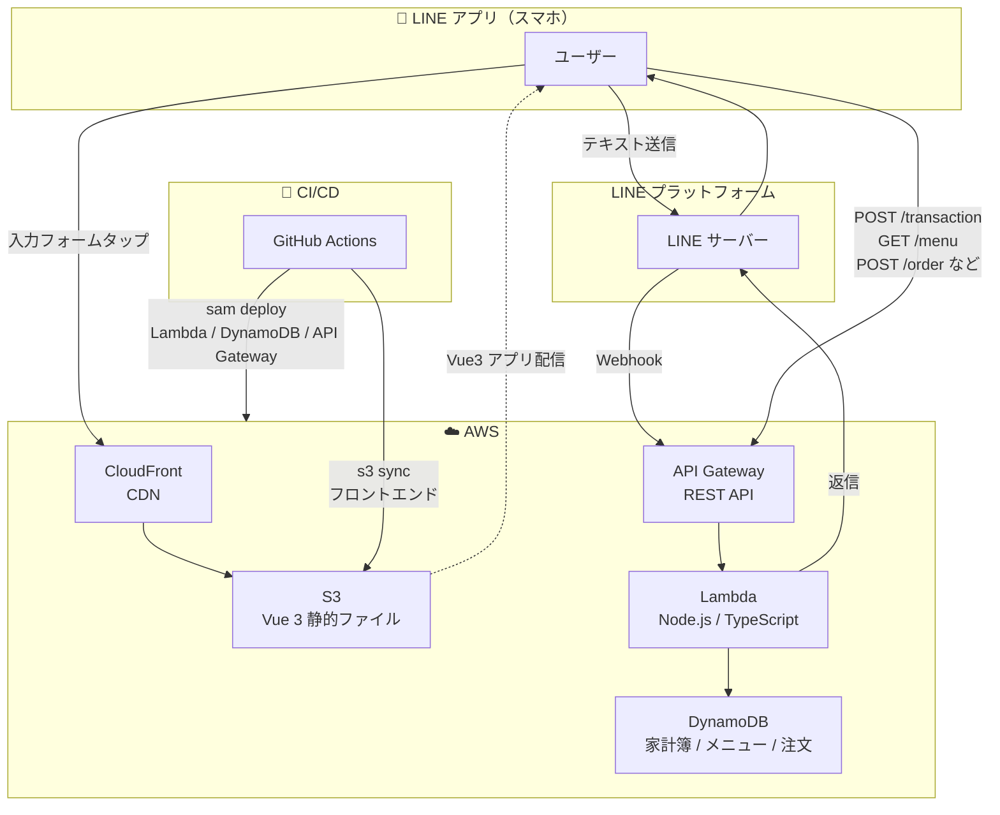
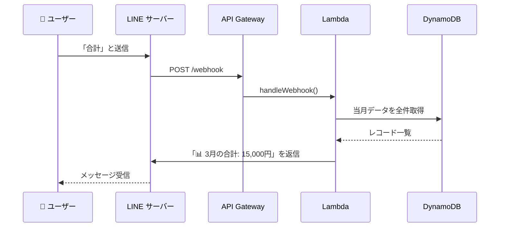
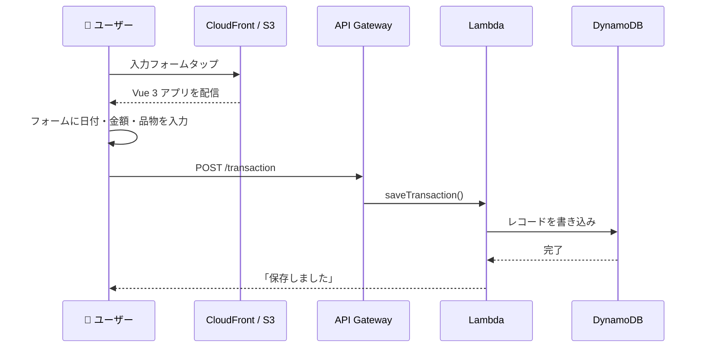

# 【記事⑧】AWS × LINE 家計簿ボット — プログラム構成とアーキテクチャ解説

> **この記事の位置づけ**: 記事①〜⑦で動くものを作った後、「なぜこのフォルダ構成にしたのか」「どこに何を書くべきか」をまとめる解説記事。コードを読み返すときや機能追加するときの地図として使う。

---

## システム構成図

> 以下の図は GitHub 上でレンダリングされる（Mermaid 記法）。VS Code では [Markdown Preview Mermaid Support](https://marketplace.visualstudio.com/items?itemName=bierner.markdown-mermaid) 拡張で確認できる。

### 全体構成



### Bot フロー（テキストメッセージ）

ユーザーが「合計」「履歴」などのキーワードを送信したときの流れ。



### LIFF フロー（入力フォーム）

リッチメニューの「入力フォーム」をタップしたときの流れ。



---

## なぜ構成を整えるのか

小さなアプリは 1 ファイルに全部書いても動く。しかし以下のような問題が出てくる。

- **変更の影響範囲が読めない**: DynamoDB のテーブル名を変えたいとき、どのファイルを直せばいいかわからない
- **同じコードが複数箇所に存在する**: DynamoDB の初期化コードが 2 ファイルに重複している
- **テストが書けない**: HTTP の処理とビジネスロジックが混在していると、ロジック単体を検証できない

これを解決するのが「**関心の分離**（Separation of Concerns）」という設計原則。「似た役割のものをまとめ、違う役割のものを切り離す」という考え方。

---

## プロジェクト全体の構成

```
line-rich-menu-app/
├── frontend/          ← Vue 3 フロントエンド（LIFF アプリ）
├── backend/           ← Lambda 関数（TypeScript / Node.js）
├── template.yaml      ← SAM テンプレート（AWS インフラ定義）
├── samconfig.toml     ← SAM デプロイ設定
└── .github/workflows/
    └── deploy.yml     ← GitHub Actions ワークフロー
```

---

## バックエンド構成

### フォルダ構成

```
backend/src/
├── index.ts                        ← ① ルーター（エントリポイント）
├── handlers/                       ← ② HTTP の入出力
│   ├── transaction.ts              ←   家計簿 CRUD
│   ├── webhook.ts                  ←   LINE Webhook 受信
│   ├── menu.ts                     ←   モバイルオーダー：メニュー取得
│   ├── order.ts                    ←   モバイルオーダー：注文作成・取得
│   └── staff.ts                    ←   モバイルオーダー：スタッフ操作
├── services/                       ← ③ ビジネスロジック
│   ├── transactionService.ts
│   └── lineService.ts
├── repositories/                   ← ④ DynamoDB 操作
│   └── transactionRepository.ts
├── clients/                        ← ⑤ 外部クライアント初期化
│   ├── dynamodb.ts
│   └── lineClient.ts
├── types/                          ← ⑥ 型定義
│   └── index.ts
└── seed/                           ← ⑦ 初期データ投入スクリプト
    └── menuSeed.ts
```

### 各層の役割

#### ① ルーター（index.ts）

Lambda のエントリポイント。API Gateway から受け取ったリクエストを「パス × メソッド」で handlers/ に振り分けるだけ。ビジネスロジックは一切書かない。

```
POST /transaction        → handlers/transaction.ts::saveTransaction
GET  /history            → handlers/transaction.ts::getHistory
GET  /summary            → handlers/transaction.ts::getSummary
POST /webhook            → handlers/webhook.ts::handleWebhook
GET  /menu               → handlers/menu.ts::getMenu
POST /order              → handlers/order.ts::postOrder
GET  /order/{orderId}    → handlers/order.ts::getOrderById
GET  /staff/orders       → handlers/staff.ts::getStaffOrders
PUT  /staff/orders/{id}/status → handlers/staff.ts::putOrderStatus
```

#### ② Handler 層（handlers/）

HTTP の入出力を担当する。`APIGatewayProxyEvent` のパース（リクエストボディの取り出し）とレスポンスの整形（JSON 変換・ステータスコード設定）のみ行う。ビジネスロジックは services/ に委譲する。

| ファイル | 担当 |
|---|---|
| `handlers/transaction.ts` | 家計簿 CRUD の HTTP 処理 |
| `handlers/webhook.ts` | LINE Webhook の HTTP 処理（署名ヘッダーの取り出しと 200 返却） |
| `handlers/menu.ts` | モバイルオーダーのメニュー取得 |
| `handlers/order.ts` | モバイルオーダーの注文作成・取得 |
| `handlers/staff.ts` | スタッフ向け注文一覧・ステータス更新 |

#### ③ Service 層（services/）

ビジネスロジックを担当する。HTTP（APIGatewayProxyEvent）の詳細を知らない。DynamoDB の詳細も知らない（Repository 経由で操作する）。

| ファイル | 担当 |
|---|---|
| `services/transactionService.ts` | 家計簿の作成・履歴取得・期間集計・当月集計 |
| `services/lineService.ts` | LINE Webhook の署名検証・イベント処理・キーワード判定 |

#### ④ Repository 層（repositories/）

DynamoDB への読み書きだけを担当する。SQL でいうと「SELECT / INSERT 文」に相当する部分。集計やフィルタはここに書かない（それは Service の仕事）。将来 DynamoDB から別の DB に切り替えるときも、このファイルだけ修正すれば済む。

| ファイル | 担当 |
|---|---|
| `repositories/transactionRepository.ts` | `PutCommand`・`QueryCommand` の実行 |

#### ⑤ Client 層（clients/）

外部サービスのクライアント初期化を一元管理する。ここに集約することで変更箇所を 1 か所にまとめる（DRY 原則）。

| ファイル | 担当 |
|---|---|
| `clients/dynamodb.ts` | `DynamoDBClient` と `DynamoDBDocumentClient` の初期化・テーブル名 |
| `clients/lineClient.ts` | `replyToLine`・`replyFlexToLine`（LINE Reply API 呼び出し） |

#### ⑥ 型定義（types/）

Handler / Service / Repository をまたいで使う TypeScript の型定義を集約する。型をここに集めることでどのファイルからも `import type { Transaction } from '../types'` で参照できる。

#### ⑦ Seed（seed/）

DynamoDB への初期データ投入スクリプト。モバイルオーダーのメニューデータを `menu-items` テーブルに登録するために使う。デプロイ後に手動で一度だけ実行する用途で、本番コードには含まれない。

---

### リクエストの流れ（バックエンド）

```
POST /transaction（家計簿保存）

API Gateway
  ↓
index.ts（ルーター）
  ↓
handlers/transaction.ts::saveTransaction()
  │  リクエストボディのパース・バリデーション
  ↓
services/transactionService.ts::createTransaction()
  │  UUID 生成・createdAt 付与・型変換
  ↓
repositories/transactionRepository.ts::putTransaction()
  │  DynamoDB PutCommand 実行
  ↓
clients/dynamodb.ts（docClient）
  ↓
DynamoDB テーブル
```

```
POST /webhook（LINE メッセージ受信）

LINE サーバー
  ↓
API Gateway
  ↓
index.ts（ルーター）
  ↓
handlers/webhook.ts::handleWebhook()
  │  x-line-signature ヘッダーの取り出し
  ↓
services/lineService.ts::verifyLineSignature()
  │  HMAC-SHA256 署名検証
  ↓
services/lineService.ts::processEvents()
  │  キーワード判定（合計 / 履歴 / ヘルプ / 機能2）
  ├── services/transactionService.ts（DynamoDB からデータ取得）
  └── clients/lineClient.ts::replyToLine()（LINE へ返信）
```

---

## フロントエンド構成

### フォルダ構成

```
frontend/src/
├── components/                ← ① UI コンポーネント（家計簿）
│   ├── TransactionForm.vue    ←   入力フォームカード
│   ├── SummaryCard.vue        ←   期間集計カード
│   └── order/                 ←   モバイルオーダー用コンポーネント
├── pages/                     ← ② ページコンポーネント（モバイルオーダー）
│   └── order/
│       ├── MenuPage.vue       ←   メニュー一覧
│       ├── CartPage.vue       ←   カート
│       ├── ConfirmPage.vue    ←   注文確認
│       ├── StatusPage.vue     ←   注文状況
│       └── staff/             ←   スタッフ向け画面
│           ├── OrderListPage.vue
│           └── OrderDetailPage.vue
├── composables/               ← ③ ロジックの再利用単位
│   ├── useLiff.ts             ←   LIFF 初期化・ユーザー情報（家計簿用）
│   ├── useTransaction.ts      ←   保存・集計の API 呼び出し
│   ├── useLiffOrder.ts        ←   LIFF 初期化（モバイルオーダー用）
│   ├── useOrder.ts            ←   注文の API 呼び出し
│   └── useCart.ts             ←   カート状態管理
├── router/                    ← ④ Vue Router 設定
│   └── index.ts               ←   パスとページコンポーネントの対応
├── utils/                     ← ⑤ 純粋な関数
│   └── date.ts                ←   JST 日付計算
├── types/                     ← ⑥ 型定義（フォルダ）
├── types.ts                   ← ⑦ 型定義（ファイル）
├── constants.ts               ← ⑧ 定数（LIFF_ID・ORDER_LIFF_ID・API_BASE_URL）
├── App.vue                    ← ⑨ 家計簿のルートコンポーネント
├── AppShell.vue               ← ⑩ ルーターのシェル（RouterView を持つ）
├── main.ts                    ← ⑪ エントリポイント
├── style.css                  ← ⑫ グローバルスタイル
└── vite-env.d.ts              ← ⑬ Vite の型定義（.vue ファイルの型宣言）
```

### AppShell.vue と Vue Router の役割

このプロジェクトは家計簿とモバイルオーダーの 2 機能を持つ。`main.ts` は `AppShell.vue` をマウントし、Vue Router がパスに応じて以下のように画面を切り替える。

```
/              → App.vue（家計簿の入力フォーム・集計）
/order         → pages/order/MenuPage.vue（メニュー一覧）
/order/cart    → pages/order/CartPage.vue（カート）
/order/confirm → pages/order/ConfirmPage.vue（注文確認）
/order/status  → pages/order/StatusPage.vue（注文状況）
/order/staff   → pages/order/staff/OrderListPage.vue（スタッフ：注文一覧）
```

### コンポーザブル（composables/）とは

Vue 3 の Composition API を使ったロジックの再利用単位。「use〇〇」という命名規則で、コンポーネントから切り離した状態管理や API 呼び出しを持てる。

```
App.vue（薄い: useLiff を呼ぶだけ）
  ↓ liffContext を prop で渡す
TransactionForm.vue（見た目）  SummaryCard.vue（見た目）
  ↓ useTransaction を呼ぶ       ↓ useTransaction を呼ぶ
useTransaction.ts（ロジック）
  ↓
axios → API Gateway → Lambda
```

### 各ファイルの役割

| ファイル | 役割 | 依存するもの |
|---|---|---|
| `AppShell.vue` | RouterView を持つシェル。main.ts がマウントするルート | `router` |
| `App.vue` | 家計簿のローディング / エラー / メイン画面の切り替え | `useLiff` |
| `TransactionForm.vue` | 入力フォームの表示と送信 | `useTransaction`, `utils/date` |
| `SummaryCard.vue` | 集計期間の入力と結果表示 | `useTransaction`, `utils/date` |
| `pages/order/` | モバイルオーダーの各画面 | `useOrder`, `useCart`, `useLiffOrder` |
| `composables/useLiff.ts` | LIFF 初期化・ログイン・ユーザー情報取得（家計簿用） | `@line/liff`, `constants` |
| `composables/useTransaction.ts` | API 呼び出し（保存・集計） | `axios`, `constants` |
| `composables/useLiffOrder.ts` | LIFF 初期化（モバイルオーダー用） | `@line/liff`, `constants` |
| `composables/useOrder.ts` | 注文の API 呼び出し | `axios`, `constants` |
| `composables/useCart.ts` | カートの状態管理（商品追加・削除・合計計算） | なし |
| `router/index.ts` | パスとページコンポーネントの対応を定義 | `vue-router` |
| `utils/date.ts` | JST の今日・当月1日の計算 | なし（純粋関数） |
| `constants.ts` | `LIFF_ID`・`ORDER_LIFF_ID`・`API_BASE_URL` | なし |
| `vite-env.d.ts` | `.vue` ファイルの TypeScript 型宣言 | なし |

---

## まとめ：どこに何を書くか

### バックエンド

| 書きたい内容 | 書く場所 |
|---|---|
| どの URL をどの関数に振り分けるか | `index.ts` |
| HTTP リクエストのパース・バリデーション | `handlers/` |
| ビジネスルール（集計・フィルタ・判定） | `services/` |
| DynamoDB の読み書き | `repositories/` |
| 外部サービスの初期化・呼び出し | `clients/` |
| 型定義 | `types/index.ts` |
| 初期データ投入 | `seed/` |

### フロントエンド

| 書きたい内容 | 書く場所 |
|---|---|
| HTML の構造・スタイル | `components/*.vue` / `pages/**/*.vue` の `<template>` |
| API 呼び出し・状態管理 | `composables/use〇〇.ts` |
| ルーティング設定 | `router/index.ts` |
| 日付や文字列の計算（フレームワーク非依存） | `utils/` |
| 定数（ID・URL） | `constants.ts` |
| 型定義 | `types.ts` / `types/` |

---

## ファイル名・フォルダ名の命名ルール

### ツール・フレームワークが要求する固定名

変えると動かなくなるもの。

| ファイル / フォルダ | 理由 |
|---|---|
| `template.yaml`（または `template.yml`） | SAM が自動で探すファイル名 |
| `samconfig.toml` | SAM が自動で探すファイル名 |
| `package.json` | npm が要求する |
| `tsconfig.json` | TypeScript コンパイラが要求する |
| `.github/workflows/` | GitHub Actions がこのパスを監視する（ファイル名は任意） |
| `.gitignore` | Git が要求する |
| `.env` | dotenv の慣習（`source .env` が前提） |
| `node_modules/` | npm が生成・参照する |
| `dist/` | Vite のビルド出力先（設定で変更可能） |
| `vite-env.d.ts` | Vite のスキャフォールドが生成する慣習名 |

### コード内参照で固定になっているもの

名前を変えるなら参照元も一緒に変える必要があるもの。

| ファイル | 参照元 |
|---|---|
| `backend/src/index.ts` | `template.yaml` の `Handler: index.handler` が `index` を指定している |
| `frontend/src/main.ts` | `index.html` の `<script src="/src/main.ts">` で指定 |
| `frontend/src/AppShell.vue` | `main.ts` が `import AppShell from './AppShell.vue'` で参照 |
| `frontend/src/router/index.ts` | `main.ts` が `import router from './router'` で参照 |
| `frontend/src/constants.ts` | 各コンポーネント・composable から `import { LIFF_ID } from '../constants'` で参照 |

### 強い慣習（変えられるが変えない方がいい）

業界標準なので、チームメンバーや AI コーディングツールがすぐ理解できる。

| 名前 | 慣習の理由 |
|---|---|
| `composables/use*.ts` | Vue 3 の公式スタイルガイドで `use` プレフィックスが規定されている |
| `components/*.vue` | Vue のコンポーネントは `components/` に置くのが標準 |
| `pages/` | ルーティングに対応したページ単位のコンポーネントを置く慣習 |
| `src/` | ソースコードのルートフォルダ名として業界全体で定着 |
| `App.vue` | Vue CLI / Vite のスキャフォールドが生成するルートコンポーネント名 |
| `index.ts` | フォルダのエントリポイントとして `index` を使う慣習（`types/index.ts` など） |

### 完全に任意（このプロジェクトでの命名）

別の名前でも動く。チームで決めればよい。

| 名前 | 代替例 |
|---|---|
| `frontend/`、`backend/` | `client/` + `server/`、`web/` + `api/` など |
| `handlers/`、`services/`、`repositories/`、`clients/` | `controllers/`、`usecases/`、`dao/`、`adapters/` など（設計思想による） |
| `deploy.yml`（ワークフロー名） | `ci.yml`、`main.yml` など |
| `github-actions-line-rich-menu-app-v4`（IAM ロール名） | 組織のネーミングルール次第 |
| `line-rich-menu-app-stack`（スタック名） | 任意（`samconfig.toml` で変更可能） |

> **まとめ**: SAM・npm・Git・GitHub Actions が要求するものだけが本当の固定名。フォルダ構成（`handlers/`・`services/` 等）は「レイヤードアーキテクチャという設計パターンの一般的な名称」を使っているだけ。Vue の `composables/use*.ts` と `pages/` だけは公式ガイドや広く使われる慣習なので外さない方がよい。

---

## esbuild のバンドルとデバッグ

### Lambda では複数ファイルが 1 ファイルに集約される

`sam build` は内部で esbuild を使い、`index.ts` を起点に `import` チェーンを辿ってすべてのファイルを 1 つの `index.js` にまとめる。Lambda 自体は複数ファイルを要求しないが、1 ファイルにバンドルする理由は 3 つある。

- **コールドスタートが速くなる** — ファイル I/O が 1 回で済む
- **node_modules が不要になる** — 依存パッケージをインライン展開するのでデプロイパッケージが小さい
- **tree-shaking が効く** — 使っていないコードを自動削除してサイズをさらに削減する

### ソースマップ問題

バンドル後の Lambda 上でエラーが起きると、CloudWatch Logs のスタックトレースはこうなる。

```
Error: Cannot read properties of undefined
  at handler (/var/task/index.js:1:4823)
```

開発者が持つコードに `index.js` の 1 行目 4823 文字目は存在しないため、どのファイルのどこで起きたか即座にわからない。

**解決策: ソースマップ（Source Map）**

ソースマップとは「バンドル後の行番号 → 元ファイルの行番号」の対応表を持つ `.map` ファイル。有効にすると元の TypeScript ファイルの行番号でエラーが表示される。

```
Error: Cannot read properties of undefined
  at saveTransaction (handlers/transaction.ts:18:23)
```

`template.yaml` の esbuild 設定と Lambda 環境変数で有効にする（すでに設定済み）。

```yaml
Metadata:
  BuildMethod: esbuild
  BuildProperties:
    Sourcemap: true                      # .map ファイルを生成する

Environment:
  Variables:
    NODE_OPTIONS: --enable-source-maps   # Node.js にソースマップを読ませる
```

---

## 参照

- [Vue 3 コンポーザブルガイド](https://ja.vuejs.org/guide/reusability/composables)
- [レイヤードアーキテクチャ（Wikipedia）](https://en.wikipedia.org/wiki/Multitier_architecture)
