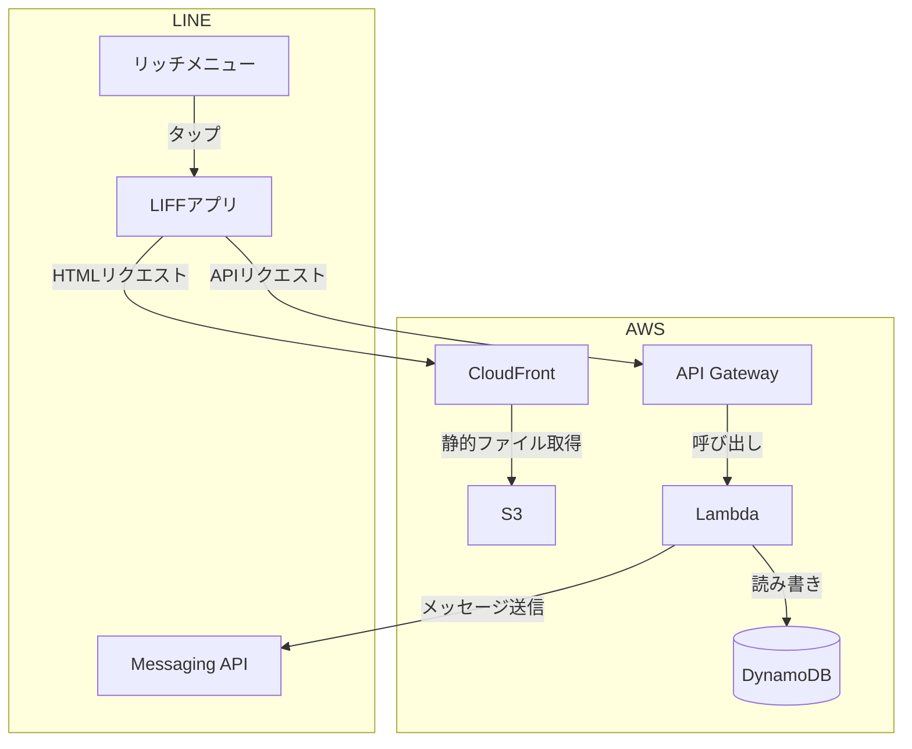

# 31. AIを使って自力で作る — LINE × AWS 家計簿ボット

> **このドキュメントの目的**
> コードや詳細設計は提示しません。
> 「何を作るか」「何を使うか」だけを示します。
> あとはAIツールと対話しながら自力で完成させてください。

---

## アプリケーション概要

### どんなアプリか

LINEから使える **個人向け家計簿アプリ** です。
スマートフォンのLINEアプリだけで支出の記録・確認ができます。
専用アプリのインストールは不要で、LINEを普段使いしている人であれば誰でも使えます。  
**アプリケーションの機能は自由に変えてもらって構いません。家計簿でなくてもOKです**

### ユーザーの操作イメージ

```
① LINEのリッチメニューをタップする
        ↓
② Webフォームが開く（LIFF）
        ↓
③ 日付・金額・品物を入力して送信する
        ↓
④ LINEのトーク画面に「登録しました」と通知が届く
        ↓
⑤ 月の合計金額を確認する
```

### 機能一覧

| 機能 | 説明 |
|---|---|
| 支出登録 | 日付・金額・品物を入力してDynamoDBに保存する |
| 月次集計 | 指定した期間の合計金額を集計して表示する |
| LINE通知 | LINEのトーク画面にメッセージを送信する |


---

## システム構成図



---

## 作業ステップ

詳細はAIに聞きながら進めてください。ステップの順番は変えないこと。

### ステップ1：AWS CLIをセットアップする

> **前提**：AWSアカウントは作成済みで、AdministratorAccess 権限を持つユーザーが存在すること。

- AWS CLIをインストールする
- 認証情報を設定する（`aws configure sso` で行う）
- 以下のサンプルコマンドが正常に実行できればゴール

```bash
# S3のバケット一覧が取得できること
aws s3 ls

# 自分のAWSアカウントIDが表示されること
aws sts get-caller-identity
```

### ステップ2：言語を選ぶ

バックエンド（Lambda）とフロントエンドで使う言語を選んでください。
後のステップはすべて選んだ言語で進めます。

**バックエンド（Lambda）の選択肢**

Lambdaは以下の言語に対応しています。得意な言語や学びたい言語を選んでください。

| 言語 | 特徴 |
|---|---|
| **Node.js（JavaScript / TypeScript）** | Webフロントエンドと同じ言語で書ける。Web開発では最もよく使われる |
| **Python** | 文法がシンプルで読みやすい。初心者に向いている |
| **Java** | 企業システムで広く使われる。型が厳密で大規模開発に向いている |
| **Ruby** | 簡潔に書ける。Railsなどと組み合わせて使われることが多い |
| **.NET（C#）** | Microsoftの技術スタック。Windowsアプリ開発者に向いている |

> **迷ったら Node.js を選んでください。** フロントエンドと同じ言語になるため、AIへの質問もまとめやすくなります。

---

### ステップ3：フロントエンドを作る

> **フロントエンドはどの言語を選んでも JavaScript（またはTypeScript）で作るのが一般的です。**
> ステップ2で選んだ言語はバックエンド（Lambda）で使います。
> フロントエンドのフレームワークは以下の表を参考にするか、AIに相談して選んでください。

**代表的なフロントエンドフレームワーク**

| フレームワーク | 特徴 |
|---|---|
| **Vue.js** | 学習コストが低く初心者に向いている |
| **React** | 世界的に最も利用者が多い |
| **Vanilla JS** | フレームワークなし。シンプルなアプリに向いている |

> 迷ったら **Vue.js** を選んでください。

### ステップ4：バックエンドを作る

> 選んだ言語でLambda関数を作成します。AIに「〇〇でLambdaを書きたい」と伝えて進めてください。

- 選んだ言語でLambda関数を作成する
- 以下のAPIを作る
  - `POST /transaction` 支出を保存する
  - `GET /summary` 期間指定で合計金額を返す
  - `POST /webhook` LINEからのメッセージを受け取る
- DynamoDBのテーブルを設計してLambdaから読み書きできるようにする

### ステップ5：AWSにデプロイする

- S3バケットを作成してフロントエンドをアップロードする
- CloudFrontディストリビューションを作成してS3と繋ぐ
- Lambda関数をデプロイする
- API Gatewayを作成してLambdaと繋ぐ

### ステップ6：LINEと連携する

- LINE DevelopersでMessaging APIチャネルを作成する
- LINE DevelopersでLINEログインチャネルを作成してLIFFを登録する
  - エンドポイントURLにCloudFrontのURLを設定する
- Messaging APIのWebhook URLにAPI GatewayのURLを設定する
- LINE公式アカウントのリッチメニューにLIFFのURLを設定する

### ステップ7：動作確認する

- LINEアプリからリッチメニューをタップしてフォームが開くか確認する
- 支出を登録してDynamoDBにデータが入るか確認する
- 期間を指定して合計金額が表示されるか確認する
- LINEのトーク画面にメッセージが届くか確認する

### ステップ8：GitHub Actionsで自動デプロイする

> 動作確認が取れたら、コードをGitHubにpushしたときに自動でデプロイされるようにします。

- GitHubにリポジトリを作成してコードをpushする
- GitHub Actionsのワークフローファイルを作成する
  - フロントエンドをビルドしてS3にアップロードする処理
  - バックエンドをSAMでデプロイする処理
- mainブランチにpushしてデプロイが自動で走るか確認する

## AIの使い方ヒント
### 最初の一言（おすすめ）

最初に **作りたいものの全体像** をAIに伝えると、何から始めればよいかナビゲートしてもらえます。

```
LINEを使った家計簿アプリを作りたいです。アプリはリッチメニューから呼び出します

【構成】
- フロントエンド：Vue.js（S3 + CloudFrontでホスティング）
- バックエンド：Node.js（AWS Lambda + API Gateway）
- データベース：DynamoDB
- LINE連携：LIFF（フォーム表示）、Messaging API（通知送信）

【機能】
- 支出の登録（日付・金額・品物）
- 期間指定で合計金額を集計
- 登録時にLINEトーク画面へ通知

開発は初めてです。
まず何から始めればよいか教えてください。
最初のステップだけ具体的に指示してください。
```

---

## ゴール

LINEのリッチメニューをタップしたとき、CloudFrontでホスティングされたWebアプリが開き、支出を登録・集計できること。またLambdaからLINEのトーク画面にメッセージが送信できること。

プログラムの構成やファイル構成は自由です。動けば正解です。
