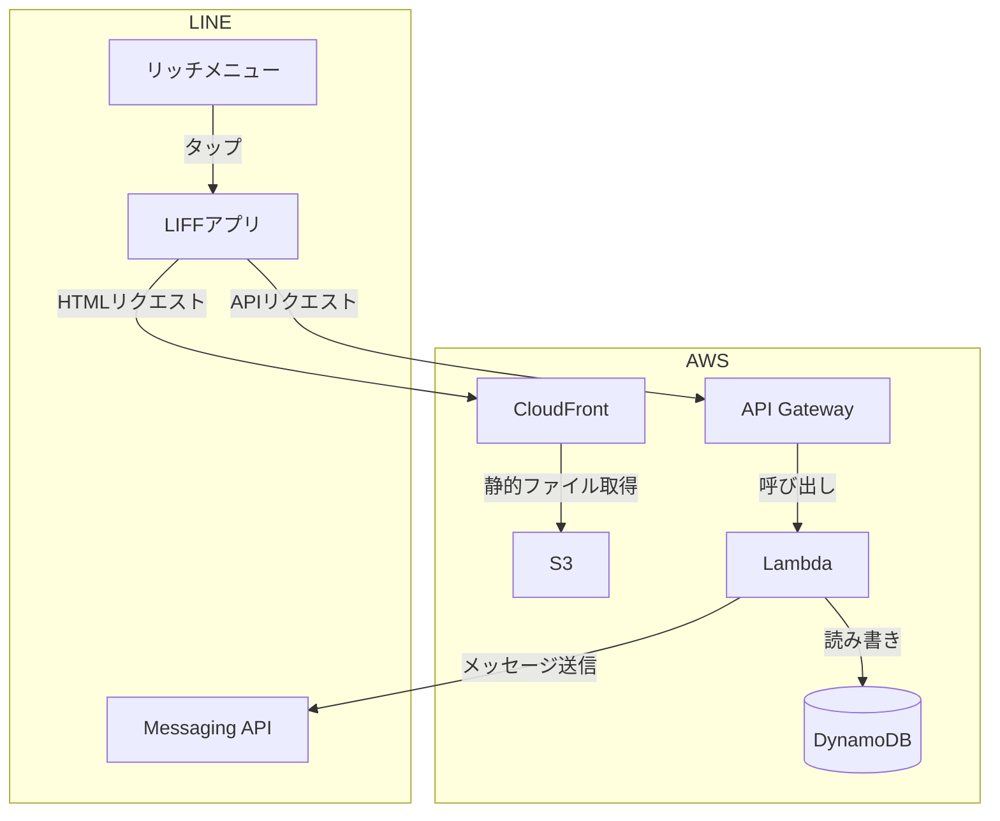

# 31. AIを使って自力でアプリ作る — LINE × AWS 家計簿ボット

> **このドキュメントの目的**
> コードや詳細設計は提示しません。
> 「何を作るか」「何を使うか」だけを示します。
> あとはAIツールと対話しながら進めてください。詰まったときは遠慮なく聞いてください。
---

## アプリケーション概要

### どんなアプリか

LINEから使える **個人向け家計簿アプリ** です。
スマートフォンのLINEアプリだけで支出の記録・確認ができます。
専用アプリのインストールは不要で、LINEを普段使いしている人であれば誰でも使えます。  
**アプリケーションの機能は自由に変えてもらって構いません。家計簿でなくてもOKです**

### ユーザーの操作イメージ

```
① LINEのリッチメニューをタップする
        ↓
② Webフォームが開く（LIFF）
        ↓
③ 日付・金額・品物を入力して送信する
        ↓
④ LINEのトーク画面に「登録しました」と通知が届く
        ↓
⑤ 月の合計金額を確認する
```

### 機能一覧

| 機能 | 説明 |
|---|---|
| 支出登録 | 日付・金額・品物を入力してDynamoDBに保存する |
| 月次集計 | 指定した期間の合計金額を集計して表示する |
| LINE通知 | LINEのトーク画面にメッセージを送信する |


---

## システム構成図



---

## 作業ステップ

ステップに書いてあることは **要件（何を作るか）** です。やり方はすべてAIに聞きながら進めてください。最終的にアプリが動けばOKです。

### ステップ1：開発環境をセットアップする

> **前提**：AWSアカウントは作成済みで、AdministratorAccess 権限を持つユーザーが存在すること。

- 作業用ディレクトリを作成する（例：`my-line-app`）
- VS Codeをインストールする
- VS Codeで作成したディレクトリを開く
- Gitをインストールする
- GitHubアカウントを作成する
- GitHubにリポジトリを作成する（名前は作業用ディレクトリと同じでよい。プライベートリポジトリでも可）
- AWS CLIをインストールする
- 認証情報を設定する（`aws configure sso` で行う）
- 以下のサンプルコマンドが正常に実行できること

```bash
# S3のバケット一覧が取得できること
aws s3 ls
```
- AIを導入する（GitHub Copilot、Cursor、Claude Code、Windsurf など）：
無料版でもスタートできます。まずは使いながら感覚を掴んでください。慣れてきたら、最新モデルが使える有料版（月20ドル程度）へのアップグレードを検討してみてください。より長い文脈を正確に読み取れるため、複雑な要件を扱うときに力を発揮します。個人的なお勧めはClaude Codeです。試してみたい場合は、GitHub Copilotが提供している「1ヶ月無料トライアル」も活用できます。

> ステップ2とステップ3はどちらを先に進めても構いません。

### ステップ2：バックエンドを作る

まず使う言語を選んでください。後のステップはすべて選んだ言語で進めます。（頭の中で決めるだけです）

| 言語 | 特徴 |
|---|---|
| **Node.js（JavaScript / TypeScript）** | Webフロントエンドと同じ言語で書ける。Web開発では最もよく使われる |
| **Python** | 文法がシンプルで読みやすい。初心者に向いている |
| **Java** | 企業システムで広く使われる。型が厳密で大規模開発に向いている |
| **Ruby** | 簡潔に書ける。Railsなどと組み合わせて使われることが多い |

> **迷ったら Node.jsとTypeScript を選んでください。** フロントエンドと同じ言語になるため、AIへの質問もまとめやすくなります。

SAM（AWS Serverless Application Model）を使ってLambda関数とインフラ定義を作ります。

- 選んだ言語でLambda関数を作る
- `template.yaml` にインフラ構成を定義する（Lambda・API Gateway・DynamoDB）
- 以下のAPIを作る
  - `POST /transaction` 支出を保存する
  - `GET /summary` 期間指定で合計金額を返す
  - `POST /webhook` LINEからのメッセージを受け取る
- DynamoDBのテーブルを設計してLambdaから読み書きできるようにする

### ステップ3：フロントエンドを作る

> **フロントエンドはどの言語を選んでも JavaScript（またはTypeScript）で作るのが一般的です。**
> フロントエンドのフレームワークは以下の表を参考にするか、AIに相談して選んでください。

| フレームワーク | 特徴 |
|---|---|
| **Vue.js** | 学習コストが低く初心者に向いている |
| **React** | 世界的に最も利用者が多い |
| **Vanilla JS** | フレームワークなし。シンプルなアプリに向いている |

> 迷ったら **Vue.js** を選んでください。

- 選んだフレームワークでフロントエンドを作る
- LIFFのSDKを使って画面を作る

**画面レイアウト例（家計簿の場合）**

```
┌─────────────────────────┐
│  支出を登録する          │
│                         │
│  日付   [2024/01/01  ]  │
│  金額   [        500]   │
│  品物   [コーヒー    ]  │
│                         │
│       [  保存する  ]    │
├─────────────────────────┤
│  集計する               │
│                         │
│  開始日 [2024/01/01  ]  │
│  終了日 [2024/01/31  ]  │
│                         │
│       [  集計する  ]    │
│                         │
│  合計：¥12,500          │
└─────────────────────────┘
```

> **動作確認はデプロイ後（ステップ6）で行います。この時点では確認不要です。**


### ステップ4：AWSにデプロイする

SAM（AWS Serverless Application Model）を使ってインフラをコードで管理します。

- SAM CLIをインストールする
- `template.yaml` にインフラ構成を定義する（S3・CloudFront・Lambda・API Gateway・DynamoDB）
- `sam build` でビルドする
- `sam deploy` でAWSにデプロイする

### ステップ5：LINEと連携する

> AWSと異なり、LINEの設定はコードで自動化できません。AIに手順を聞きながらLINE Developersの管理画面で手動で設定してください。
> LINE DevelopersおよびLINE Official Account Managerのアカウントをお持ちでない方は事前に作成してください。

- LINE DevelopersでMessaging APIチャネルを作成する
- LINE DevelopersでLINEログインチャネルを作成してLIFFを登録する
  - エンドポイントURLにCloudFrontのURLを設定する
- Messaging APIのWebhook URLにAPI GatewayのURLを設定する
- LINE Official Account ManagerでリッチメニューにLIFFのURLを設定する

### ステップ6：動作確認する

- LINEアプリからリッチメニューをタップしてフォームが開くか確認する
- 支出を登録してDynamoDBにデータが入るか確認する
- 期間を指定して合計金額が表示されるか確認する
- LINEのトーク画面にメッセージが届くか確認する

### ステップ7：GitHub Actionsで自動デプロイする

- GitHubのリポジトリにコードをpushする
- AWS側でOIDCプロバイダーとIAMロールを設定する
- 必要な認証情報をGitHub Secretsに登録する
- GitHub Actionsのワークフローファイルを作成する
  - AWSへの認証はアクセスキーを使わずIAMロールを引き受ける方式（OIDC）で行う
  - フロントエンドをビルドしてS3にアップロードする処理
  - バックエンドをSAMでデプロイする処理
- GitHubのリポジトリにpushしてデプロイが自動で走るか確認する
